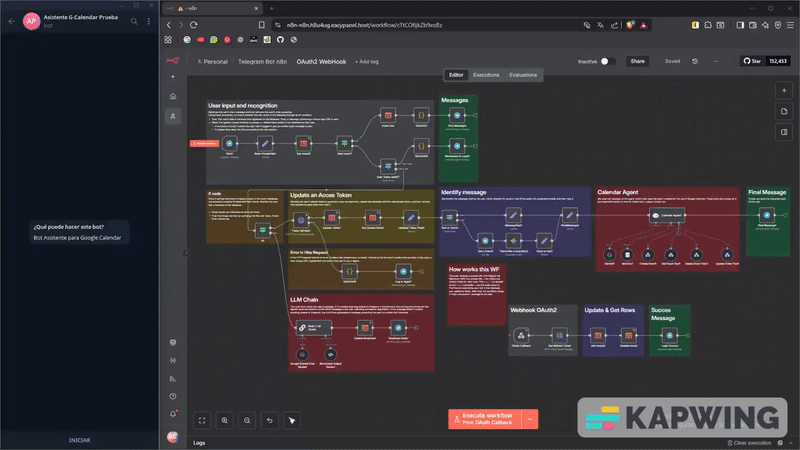

# 🤖 Telegram Calendar Assistant

**A smart Telegram bot that connects seamlessly with Google Calendar.**

Your personal scheduling assistant. Perfect for personal use, small teams, or as a monetizable service.

## 🎬 See it in action

## ✨ Key Features

### 🔐 Authentication & AI
- **One-time OAuth2 login** with automatic token refresh and session recovery
- **Natural language processing** - Talk naturally using Google Gemini
- **Voice & text support** - Send voice messages, transcribed instantly
- **Conversation memory** - Contextual interactions across messages

### 📅 Full Calendar Control

**4 specialized tools:**
- ✅ **Create** events with all details
- 📖 **Read** upcoming events
- ✏️ **Update** existing events
- ❌ **Delete** events

Plus timezone support and complete CRUD operations.

### 🔗 Technical Features
- Real-time Telegram webhooks
- Persistent database (users, tokens, preferences)
- Smart user flow (new vs. returning users)

## 🛠️ Built With

n8n · Google Gemini 2.5 Flash · Telegram Bot API · Google Calendar API · OAuth2

## 📚 What I Learned

- Implementing OAuth2 flows and token lifecycle management
- Building AI agents with LangChain and custom tools
- Webhook architecture for real-time communication
- Multi-user database design
- Voice-to-text integration with modern LLMs

## ⚙️ Prerequisites

n8n account · Google Cloud (Calendar API) · Telegram bot token · Gemini API key

**Note:** Custom calendar tools are proprietary. Contact me to learn more.

## 💡 Future Enhancements

🔄 Switch to OpenAI · 🔔 Smart reminders · 🌍 Multi-language · 📊 Analytics

---

## 📩 Contact & License

Personal portfolio project by **Karim González**

Questions or ideas? **karim.glzm@gmail.com**

**MIT License** - See [LICENSE](LICENSE) for details

**Made with ❤️ as a learning project**

---

# 🤖 Asistente de Calendario para Telegram

**Un bot inteligente de Telegram que se conecta perfectamente con Google Calendar.**

Tu asistente personal de agenda. Perfecto para uso personal, equipos pequeños, o como servicio monetizable.

## 🎬 Míralo en acción

## ✨ Características Principales

### 🔐 Autenticación e IA
- **Inicio de sesión único OAuth2** con renovación automática de tokens y recuperación de sesión
- **Procesamiento de lenguaje natural** - Habla naturalmente usando Google Gemini
- **Soporte de voz y texto** - Envía mensajes de voz, transcritos instantáneamente
- **Memoria conversacional** - Interacciones contextuales a lo largo de los mensajes

### 📅 Control Completo del Calendario

**4 herramientas especializadas:**
- ✅ **Crear** eventos con todos los detalles
- 📖 **Leer** eventos próximos
- ✏️ **Actualizar** eventos existentes
- ❌ **Eliminar** eventos

Además, soporte de zonas horarias y operaciones CRUD completas.

### 🔗 Características Técnicas
- Webhooks de Telegram en tiempo real
- Base de datos persistente (usuarios, tokens, preferencias)
- Flujo inteligente de usuarios (nuevos vs. recurrentes)

## 🛠️ Construido Con

n8n · Google Gemini 2.5 Flash · Telegram Bot API · Google Calendar API · OAuth2

## 📚 Lo Que Aprendí

- Implementación de flujos OAuth2 y gestión del ciclo de vida de tokens
- Construcción de agentes de IA con LangChain y herramientas personalizadas
- Arquitectura de webhooks para comunicación en tiempo real
- Diseño de bases de datos multiusuario
- Integración de voz a texto con LLMs modernos

## ⚙️ Requisitos Previos

Cuenta de n8n · Google Cloud (Calendar API) · Token de bot de Telegram · API key de Gemini

**Nota:** Las herramientas personalizadas de calendario son propietarias. Contáctame para saber más.

## 💡 Mejoras Futuras

🔄 Cambiar a OpenAI · 🔔 Recordatorios inteligentes · 🌍 Multiidioma · 📊 Analíticas

---

## 📩 Contacto y Licencia

Proyecto personal de portfolio por **Karim González**

¿Preguntas o ideas? **karim.glzm@gmail.com**

**Licencia MIT** - Ver archivo [LICENSE](LICENSE) para detalles

**Hecho con ❤️ como proyecto de aprendizaje**
